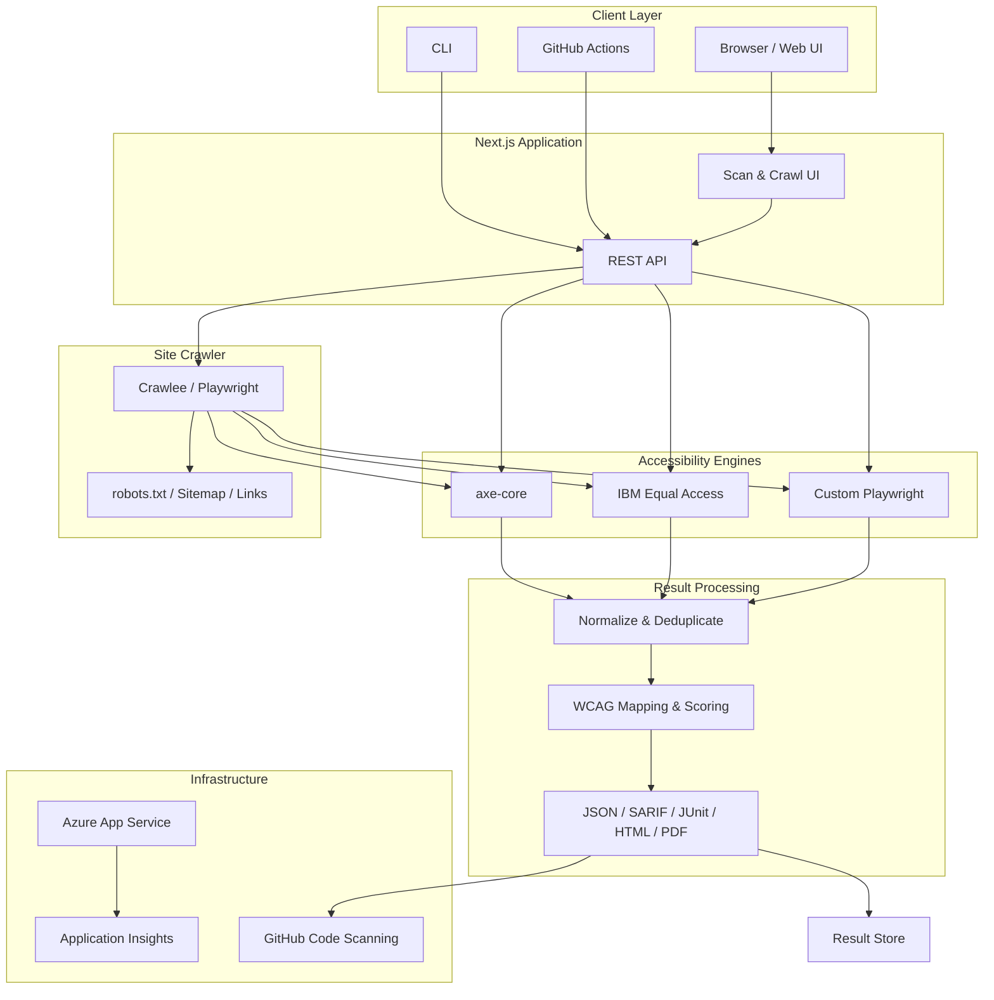

```
---
title: A11yLab
description: Production-style web accessibility engineering platform for WCAG 2.2 Level AA auditing, remediation, automated testing, and CI/CD validation.
---
```

# A11yLab

**Web Accessibility Engineering • WCAG 2.2 • WAI-ARIA • Automated Testing • Remediation**

A11yLab is a full-stack web accessibility engineering platform designed to evaluate, diagnose, remediate, and continuously validate accessibility across modern web applications.

The project combines automated accessibility scanning with manual testing workflows, WCAG 2.2 Level AA mapping, WAI-ARIA analysis, keyboard accessibility, screen-reader validation, actionable remediation guidance, and CI/CD regression testing.

The objective is to treat accessibility as an engineering requirement throughout the software development lifecycle rather than as a final compliance check.

---

## Overview

A11yLab provides an end-to-end accessibility workflow:

```text
Web Application
      │
      ▼
Accessibility Scan
      │
      ├── axe-core
      ├── IBM Equal Access
      └── Custom Playwright Checks
      │
      ▼
Normalize & Deduplicate
      │
      ▼
WCAG Mapping & Scoring
      │
      ▼
Accessibility Report
      │
      ▼
Remediation
      │
      ▼
Keyboard + Screen Reader Testing
      │
      ▼
Regression Testing
      │
      ▼
CI/CD Validation
````

Supports both **single-page scans** and **site-wide accessibility evaluation** with configurable crawling, depth, and concurrency.

---

# Key Capabilities

## Accessibility Evaluation

* Single-page accessibility scanning
* Site-wide accessibility crawling
* WCAG 2.2 Level AA evaluation
* Accessibility issue detection
* Severity-based prioritization
* WCAG success-criteria mapping
* Accessibility scoring and grading
* Actionable remediation guidance

## Testing

* Automated accessibility testing
* axe-core analysis
* IBM Equal Access analysis
* Custom Playwright checks
* Keyboard-only testing
* Focus-management testing
* Screen-reader testing
* Accessibility regression testing

## Developer Tooling

* Accessibility dashboard
* CLI accessibility scanner
* GitHub Actions integration
* CI threshold gating
* SARIF output
* JSON reports
* JUnit reports
* HTML reports
* PDF reports

## Security

* SSRF protection
* Localhost blocking
* Private-network protection
* Internal-hostname protection
* Controlled crawling
* Configurable crawl depth
* Configurable concurrency

---

# Accessibility Standards

## WCAG 2.2

A11yLab focuses on the four WCAG principles:

* **Perceivable**
* **Operable**
* **Understandable**
* **Robust**

Supported accessibility tags include:

```text
wcag2a
wcag2aa
wcag21a
wcag21aa
wcag22aa
best-practice
```

## WAI-ARIA

Coverage includes:

* Roles
* States
* Properties
* Accessible names
* Descriptions
* Live regions
* Dialogs
* Tabs
* Accordions
* Navigation
* Menus
* Forms
* Custom interactive controls

Semantic HTML is preferred whenever native browser semantics provide the required behavior.

---

# Architecture

A11yLab uses a modular architecture separating the client layer, application APIs, accessibility engines, crawling, result processing, reporting, and infrastructure.



### Core Flow

```text
Client
  │
  ▼
Next.js API
  │
  ├── Single Scan ──┐
  │                 │
  └── Site Crawl ──┤
                    ▼
          Accessibility Engines
             ┌──────┼──────┐
             │      │      │
            axe    IBM   Custom
             └──────┼──────┘
                    ▼
          Normalize & Deduplicate
                    │
                    ▼
             WCAG Mapping
                    │
                    ▼
             Scoring Engine
                    │
                    ▼
                 Reports
                    │
                    ▼
              Result Store
```

### Site-Wide Flow

```text
Crawl API
   │
   ▼
Crawlee
   │
   ├── robots.txt
   ├── Sitemap
   └── Link Discovery
          │
          ▼
   Page-by-Page Scan
          │
          ▼
 Accessibility Engines
          │
          ▼
  Result Processing
          │
          ▼
   Site-Wide Report
```

---

# Scanning Architecture

A11yLab uses multiple complementary accessibility engines.

## axe-core

The primary automated accessibility engine, integrated through:

```text
@axe-core/playwright
```

Findings include:

* Rule ID
* Impact
* Description
* Help text
* WCAG tags
* Affected HTML nodes
* Remediation guidance

## IBM Equal Access

Used as a complementary accessibility engine. Results are normalized with other scanner outputs to improve coverage and reduce duplicate findings.

## Custom Playwright Checks

Browser-based checks cover application-specific accessibility behavior, including:

* Ambiguous link text
* `aria-current` behavior
* Semantic patterns
* Accessible content
* Focusable elements obscured by sticky UI
* Application-specific accessibility rules

---

# Result Processing Pipeline

```text
axe-core
    │
IBM Equal Access
    │
Custom Checks
    │
    ▼
Normalizer
    │
    ▼
Deduplicator
    │
    ▼
WCAG Mapper
    │
    ▼
Severity Classifier
    │
    ▼
Scoring Engine
    │
    ▼
Report Generator
```

This provides a consistent representation of findings from multiple accessibility engines.

---

# WCAG Scoring

Findings are prioritized according to impact.

| Impact   | Weight |
| -------- | -----: |
| Critical |     10 |
| Serious  |      7 |
| Moderate |      3 |
| Minor    |      1 |

Overall score:

```text
(weighted passes / weighted total) × 100
```

| Score | Grade |
| ----: | :---: |
|   90+ |   A   |
| 70–89 |   B   |
| 50–69 |   C   |
| 30–49 |   D   |
|   <30 |   F   |

Site-wide scans aggregate results across individual pages.

---

# Accessibility Findings

Each finding is represented as an actionable engineering issue.

```text
Issue:
Button does not have an accessible name.

Impact:
Serious

WCAG:
4.1.2 Name, Role, Value

Affected Element:
<button>

Problem:
Screen-reader users cannot determine the purpose
of the interactive control.

Recommended Fix:
Provide a meaningful accessible name using
visible text or an appropriate naming mechanism.

Verification:
Keyboard
VoiceOver
NVDA
axe-core
```

---

# Remediation Workflow

```text
Detect
  ↓
Understand
  ↓
Classify
  ↓
Fix
  ↓
Verify
  ↓
Prevent Regression
```

## Example

### Before

```tsx
<button>
  <SettingsIcon />
</button>
```

### After

```tsx
<button
  type="button"
  aria-label="Open settings"
>
  <SettingsIcon aria-hidden="true" />
</button>
```

### Verification

```text
✓ Keyboard interaction
✓ Visible focus
✓ VoiceOver
✓ NVDA
✓ Automated accessibility test
```

---

# Keyboard Accessibility

A11yLab validates keyboard interaction independently from automated scanning.

Supported interactions include:

```text
Tab
Shift + Tab
Enter
Space
Escape
Arrow Keys
```

Testing includes:

* Logical focus order
* Visible focus indicators
* Keyboard-operable controls
* Skip links
* Modal focus management
* Focus trapping
* Focus restoration
* Keyboard traps
* Custom component interaction

---

# Screen Reader Testing

Automated tools cannot fully determine whether an experience works correctly with assistive technology.

A11yLab includes manual screen-reader testing workflows.

## VoiceOver

```text
macOS
Safari
VoiceOver
```

Test areas:

* Navigation
* Headings
* Landmarks
* Links
* Buttons
* Forms
* Dialogs
* Dynamic content
* Error messages
* Focus changes

## NVDA

```text
Windows
Chrome / Firefox
NVDA
```

Test areas:

* Heading navigation
* Landmark navigation
* Form controls
* Buttons
* Links
* Dialogs
* Status messages
* Dynamic content
* Keyboard interaction

## JAWS

```text
Windows
Supported browser
JAWS
```

Test areas:

* Forms
* Navigation
* Interactive controls
* Dialogs
* Accessible names
* Dynamic content

---

# Accessible Forms

A11yLab provides accessible form patterns covering:

* Form labels
* Instructions
* Required fields
* Descriptions
* Validation
* Error messages
* Error announcements
* Focus management

Example:

```html
<label for="email">
  Email address
</label>

<input
  id="email"
  name="email"
  type="email"
  aria-describedby="email-help"
  autocomplete="email"
/>

<p id="email-help">
  Enter the email address associated with your account.
</p>
```

---

# Accessible Components

Accessibility-focused component patterns include:

```text
AccessibleButton
AccessibleDialog
AccessibleForm
AccessibleInput
AccessibleNavigation
AccessibleTabs
AccessibleAccordion
AccessibleAlert
AccessibleTooltip
AccessibleMenu
AccessiblePagination
```

Components should consider:

* Semantic HTML
* Accessible naming
* Keyboard interaction
* Focus management
* ARIA semantics
* Screen-reader behavior
* Automated testing

---

# Accessibility Testing Strategy

A11yLab combines automated and manual accessibility testing.

```text
              Accessibility Testing
                       │
          ┌────────────┴────────────┐
          │                         │
      Automated                   Manual
          │                         │
    ┌─────┼─────┐             ┌────┼────┐
    │     │     │             │    │    │
   axe   IBM  Custom       Keyboard  SR  Visual
    │     │     │             │    │    │
    └─────┼─────┘             └────┼────┘
          │                         │
          └────────────┬────────────┘
                       ▼
                 Remediation
                       │
                       ▼
                Regression Tests
```

---

# Automated Accessibility Tests

Example Playwright test:

```typescript
import { test, expect } from "@playwright/test";
import AxeBuilder from "@axe-core/playwright";

test("homepage accessibility", async ({ page }) => {
  await page.goto("/");

  const results = await new AxeBuilder({ page })
    .withTags([
      "wcag2a",
      "wcag2aa",
      "wcag21aa",
      "wcag22aa"
    ])
    .analyze();

  expect(results.violations).toEqual([]);
});
```

---

# CLI

Build the project:

```bash
npm run build
```

## Single-Page Scan

```bash
a11y-scan scan \
  --url https://example.com \
  --threshold 80 \
  --format sarif \
  --output results/
```

## Site-Wide Crawl

```bash
a11y-scan crawl \
  --url https://example.com \
  --max-pages 100 \
  --max-depth 3 \
  --concurrency 3 \
  --threshold 70 \
  --format json
```

---

# Configuration

Create:

```text
.a11yrc.json
```

Example:

```json
{
  "url": "https://example.com",
  "threshold": 80,
  "output": "./results",
  "format": "sarif",
  "crawl": {
    "maxPages": 100,
    "maxDepth": 3,
    "concurrency": 3
  }
}
```

---

# GitHub Actions

Accessibility checks can run directly in CI/CD.

```yaml
name: Accessibility Tests

on:
  push:
    branches:
      - main
  pull_request:

jobs:
  accessibility:
    runs-on: ubuntu-latest

    steps:
      - name: Checkout
        uses: actions/checkout@v4

      - name: Setup Node.js
        uses: actions/setup-node@v4
        with:
          node-version: 20

      - name: Install dependencies
        run: npm ci

      - name: Install Playwright
        run: npx playwright install --with-deps chromium

      - name: Run unit tests
        run: npm test

      - name: Run accessibility tests
        run: npm run test:a11y
```

---

# CI Quality Gates

```text
Code Change
     ↓
Pull Request
     ↓
Lint
     ↓
Unit Tests
     ↓
Accessibility Tests
     ↓
Playwright Tests
     ↓
Build
     ↓
Review
     ↓
Merge
```

CI gates can enforce:

* Accessibility score
* Violation count
* Severity thresholds
* Specific rule IDs

---

# SARIF Integration

Accessibility results can be exported as SARIF and integrated with GitHub Code Scanning.

```text
Application
    ↓
Accessibility Scan
    ↓
SARIF
    ↓
GitHub Actions
    ↓
Code Scanning
    ↓
Accessibility Findings
```

This brings accessibility feedback directly into the engineering workflow.

---

# Reports

Supported formats:

```text
JSON
SARIF 2.1.0
JUnit XML
HTML
PDF
```

Reports can contain:

* Overall score
* Accessibility grade
* Violation counts
* Severity
* WCAG references
* Rule descriptions
* Affected elements
* Remediation guidance
* Verification status

---

# Site-Wide Crawling

The crawler supports:

* Breadth-first traversal
* Configurable maximum pages
* Configurable crawl depth
* Configurable concurrency
* `robots.txt` handling
* Sitemap discovery
* Per-page accessibility results
* Aggregated site score

```text
Website
  │
  ├── Home
  ├── Products
  │     ├── Product A
  │     └── Product B
  ├── About
  └── Contact
        │
        ▼
 Accessibility Scan
        │
        ▼
 Per-page Findings
        │
        ▼
 Site-wide Report
```

---

# Security

External URL scanning introduces security considerations.

A11yLab includes protections against:

* SSRF
* Localhost scanning
* Private IP addresses
* Internal hostnames
* Unsafe redirects
* Uncontrolled crawling
* Excessive concurrency
* Resource exhaustion

External scanning should never provide unrestricted access to internal infrastructure.

---

# Observability

The platform supports structured logging and telemetry.

| Metric                | Type      |
| --------------------- | --------- |
| `scan.total`          | Counter   |
| `scan.errors`         | Counter   |
| `scan.duration_ms`    | Histogram |
| `crawl.total`         | Counter   |
| `crawl.errors`        | Counter   |
| `crawl.duration_ms`   | Histogram |
| `crawl.pages_scanned` | Histogram |

---

# Technology Stack

| Category             | Technology                    |
| -------------------- | ----------------------------- |
| Framework            | Next.js 15                    |
| UI                   | React 19                      |
| Language             | TypeScript 5                  |
| Styling              | Tailwind CSS                  |
| Accessibility Engine | axe-core                      |
| Secondary Engine     | IBM Equal Access              |
| Browser Automation   | Playwright                    |
| Crawling             | Crawlee                       |
| Unit Testing         | Vitest                        |
| E2E Testing          | Playwright                    |
| PDF Generation       | Puppeteer                     |
| CLI                  | Commander                     |
| Containerization     | Docker                        |
| CI/CD                | GitHub Actions                |
| Cloud                | Azure                         |
| Infrastructure       | Azure Bicep                   |
| Observability        | OpenTelemetry / Azure Monitor |

---

# Project Structure

```text
a11ylab/
│
├── scripts/
│
├── src/
│   ├── app/
│   │   ├── api/
│   │   │   ├── scan/
│   │   │   ├── crawl/
│   │   │   └── ci/
│   │   ├── scan/
│   │   │   └── [id]/
│   │   └── crawl/
│   │       └── [id]/
│   │
│   ├── components/
│   │   ├── ScanForm/
│   │   ├── ReportView/
│   │   └── accessibility/
│   │
│   ├── cli/
│   │
│   └── lib/
│       ├── logger.ts
│       ├── telemetry.ts
│       ├── scanner/
│       │   ├── axe/
│       │   ├── ibm/
│       │   └── custom/
│       ├── crawler/
│       ├── scoring/
│       ├── report/
│       ├── ci/
│       └── types/
│
├── e2e/
│   ├── accessibility/
│   ├── keyboard/
│   └── screen-reader/
│
├── accessibility-audits/
│   ├── findings/
│   └── reports/
│
├── remediation-guides/
├── reports/
├── action/
├── infra/
│
├── .github/
│   ├── agents/
│   ├── prompts/
│   ├── instructions/
│   └── workflows/
│       ├── ci.yml
│       ├── accessibility.yml
│       └── deploy.yml
│
├── Dockerfile
├── package.json
└── README.md
```

---

# Accessibility Audit Methodology

A11yLab follows a structured accessibility engineering process:

1. **Automated Analysis** — Run accessibility engines against the target application.
2. **Normalization** — Normalize findings from multiple engines.
3. **Deduplication** — Remove duplicate violations.
4. **WCAG Mapping** — Map findings to relevant success criteria.
5. **Impact Assessment** — Prioritize issues by user impact.
6. **Manual Verification** — Validate using keyboard, browser inspection, screen readers, and visual inspection.
7. **Remediation** — Implement the appropriate code-level fix.
8. **Verification** — Re-run automated and manual tests.
9. **Regression Prevention** — Add tests to prevent recurrence.

---

# Accessibility Finding Lifecycle

```text
Detected
   ↓
Triaged
   ↓
WCAG Mapped
   ↓
Reproduced
   ↓
Remediation Planned
   ↓
Code Fixed
   ↓
Automated Test
   ↓
Manual Verification
   ↓
Verified
   ↓
Regression Protected
```

---

# Developer Accessibility Checklist

## Semantic Structure

```text
[ ] Correct semantic HTML
[ ] Logical heading hierarchy
[ ] Meaningful landmarks
[ ] Links used for navigation
[ ] Buttons used for actions
```

## Keyboard

```text
[ ] All controls keyboard accessible
[ ] Logical tab order
[ ] Visible focus indicator
[ ] No keyboard trap
[ ] Dialog focus handled correctly
[ ] Escape behavior implemented where required
```

## Forms

```text
[ ] Every input has an accessible name
[ ] Instructions are available
[ ] Required state is communicated
[ ] Errors are understandable
[ ] Error state is programmatically associated
[ ] Focus moves appropriately after validation
```

## ARIA

```text
[ ] Native HTML preferred
[ ] ARIA used only where necessary
[ ] Correct role
[ ] Correct state
[ ] Correct property
[ ] Accessible name verified
```

## Screen Readers

```text
[ ] VoiceOver tested where applicable
[ ] NVDA tested where applicable
[ ] JAWS tested where applicable
[ ] Dynamic content announced correctly
[ ] Dialogs announced correctly
[ ] Form errors announced correctly
```

## Visual

```text
[ ] Color contrast checked
[ ] Information not conveyed by color alone
[ ] Focus visible
[ ] Content remains usable at increased zoom
[ ] Responsive layout remains accessible
```

---

# Development

## Prerequisites

* Node.js 20+
* npm 10+
* Git

Optional:

* Docker
* macOS for VoiceOver testing
* Windows for NVDA / JAWS testing

## Installation

```bash
git clone https://github.com/<your-username>/a11ylab.git
cd a11ylab
npm install
```

Install Playwright browsers:

```bash
npx playwright install --with-deps chromium
```

## Development Server

```bash
npm run dev
```

Open:

```text
http://localhost:3000
```

## Unit Tests

```bash
npm test
```

## Test Coverage

```bash
npm run test:coverage
```

## Accessibility Tests

```bash
npm run test:a11y
```

## Lint

```bash
npm run lint
```

## Production Build

```bash
npm run build
```

---

# Docker

Build:

```bash
docker build -t a11ylab:local .
```

Run:

```bash
docker run -d \
  --name a11ylab \
  -p 3000:3000 \
  a11ylab:local
```

---

# Environment Variables

| Variable                                | Required | Default | Description                                  |
| --------------------------------------- | -------- | ------- | -------------------------------------------- |
| `PORT`                                  | No       | `3000`  | Application port                             |
| `LOG_LEVEL`                             | No       | `info`  | Logging level                                |
| `APPLICATIONINSIGHTS_CONNECTION_STRING` | No       | —       | Azure Application Insights connection string |
| `NODE_OPTIONS`                          | No       | —       | Node.js runtime options                      |

---

# Engineering Principles

## Accessibility First

Accessibility is considered during design, implementation, testing, and deployment.

## Semantic HTML First

Use native HTML semantics before reaching for ARIA.

## Automated Testing Is Not Enough

Automated scanners identify only a subset of accessibility issues.

## Test Real User Workflows

Keyboard and assistive-technology testing validate how people actually interact with the application.

## Fix Root Causes

Remediation should improve the underlying component or design pattern rather than hide individual violations.

## Prevent Regression

Accessibility testing belongs inside the development and CI/CD workflow.

## Document Decisions

Accessibility findings should explain:

```text
What is wrong
Why it matters
Who is affected
Which WCAG criterion applies
How to fix it
How the fix was verified
```

---

# Roadmap

## Phase 1 — Core Scanner

* [x] Single-page scanning
* [x] WCAG 2.2 analysis
* [x] axe-core integration
* [x] Multiple scanning engines
* [x] Result normalization
* [x] Deduplication
* [x] Severity classification

## Phase 2 — Accessibility Engineering

* [ ] Accessible React component library
* [ ] WCAG remediation examples
* [ ] WAI-ARIA component patterns
* [ ] Keyboard interaction tests
* [ ] Focus-management tests
* [ ] Accessibility finding workflow

## Phase 3 — Assistive Technology

* [ ] VoiceOver testing documentation
* [ ] NVDA testing documentation
* [ ] JAWS testing documentation
* [ ] Screen-reader regression scenarios

## Phase 4 — Developer Tooling

* [ ] CLI improvements
* [ ] SARIF integration
* [ ] Pull-request accessibility checks
* [ ] CI accessibility gates
* [ ] Accessibility regression reporting

## Phase 5 — Engineering Platform

* [ ] Accessibility dashboard
* [ ] Site-wide monitoring
* [ ] Historical accessibility trends
* [ ] Team-level reporting
* [ ] Accessibility quality gates
* [ ] Developer remediation workflows

---

# Contributing

Accessibility changes should include:

1. Description of the change.
2. Accessibility impact.
3. Relevant WCAG success criteria.
4. Keyboard testing results.
5. Screen-reader testing results where applicable.
6. Automated test results.
7. Remediation details.

Pull requests should avoid introducing new accessibility regressions.

---

# License

MIT License

---

## Accessibility Is Engineering Quality

A11yLab is built around a simple principle:

```text
Design inclusively
       ↓
Build accessibly
       ↓
Test automatically
       ↓
Test manually
       ↓
Fix systematically
       ↓
Verify with assistive technology
       ↓
Prevent regressions
```

**Build for everyone. Test for everyone.**


